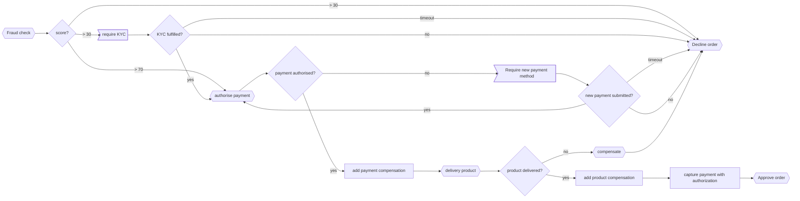

# temporal-poc
Temporal.IO Proof of concept

## Requirements
To run this POC you will need:
* Temporal.io installed and running (https://github.com/temporalio/temporal)
* Maven
* Java 1.8 or later

Example workflow and activities will register when the application starts, no need to manual register anything.

## Workflow flow chart:


## Starting poc
After that, you can start the spring-boot application by typing on command line:
```bash
mvn spring-boot:run
```

## Firing orders
On another terminal, submit an order to be processed:
```bash
curl -H 'Content-Type:application/json' -H 'Accept:application/json' -X POST http://localhost:8081/order -d '{ "orderId": "1" }'
```
If you prefer, you can submit several this way (orderId will be created randomly):
```bash
for i in {1..10}; do 
  curl -H 'Content-Type:application/json' -H 'Accept:application/json' -X POST http://localhost:8081/order -d '{ }' 
done;
```
Now navigate to `http://localhost:8080` to check your workflow UI and the application logs.

if you want to check order progression you can use
```bash
curl -H 'Content-Type:application/json' -H 'Accept:application/json' -X GET http://localhost:8081/order/1'
```

if you need to complete KYC for an order
```bash
curl -H 'Content-Type:application/json' -H 'Accept:application/json' -X PATCH http://localhost:8081/order/18 -d '{ "completedKyc": true }'
```
if you need to change the payment method for an order
```bash
curl -H 'Content-Type:application/json' -H 'Accept:application/json' -X PATCH http://localhost:8081/order/18 -d '{ "newPaymentMethod": true }'
```
